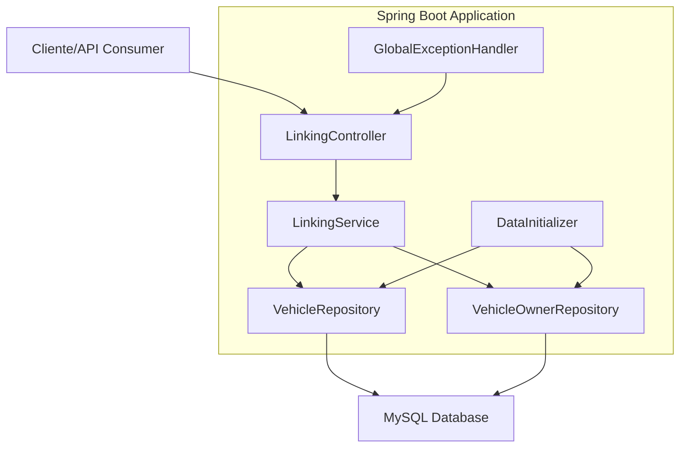

# 🚗🔍 Sistema de Detección de Matrículas

[](https://openjdk.java.net/projects/jdk/21/)
[](https://spring.io/projects/spring-boot)
[](https://www.mysql.com/)
[](https://maven.apache.org/)

Sistema backend completo desarrollado en **Spring Boot 3.3.x** con **Java 21** para la detección y vinculación de matrículas de vehículos con sus propietarios. Incluye configuración avanzada con profiles para desarrollo y producción, integración con **MySQL**, y una API REST completa.

## 📋 Tabla de Contenidos

- [Características](#-características)
- [Arquitectura](#-arquitectura)
- [Tecnologías](#️-tecnologías)
- [Instalación](#-instalación)
- [Configuración](#️-configuración)
- [Uso](#-uso)
- [API Endpoints](#-api-endpoints)
- [Base de Datos](#️-base-de-datos)
- [Profiles](#-profiles)
- [Datos de Prueba](#-datos-de-prueba)
- [Monitoreo](#-monitoreo)
- [Contribución](#-contribución)

## ✨ Características

- **🏗️ Arquitectura Moderna**: Spring Boot 3.3.x con Java 21
- **🔍 Detección de Matrículas**: API REST para consultar vehículos por matrícula
- **👥 Gestión de Propietarios**: Vinculación de vehículos con sus dueños
- **🗄️ Base de Datos MySQL**: Integración completa con JPA/Hibernate
- **🔧 Profiles Configurables**: Entornos de desarrollo y producción
- **📊 Monitoreo**: Spring Boot Actuator integrado
- **🛡️ Manejo de Errores**: Sistema robusto de excepciones
- **📝 Datos de Prueba**: Inicialización automática para testing
- **🚀 Java 21 Features**: Records, Pattern Matching, Text Blocks

## 🏛️ Arquitectura



### Componentes Principales

- **Entidades JPA**: `VehicleOwner`, `Vehicle`
- **Repositorios**: `VehicleOwnerRepository`, `VehicleRepository`
- **DTOs**: `VehicleOwnerDto`, `VehicleDetailsDto`, `ErrorResponseDto`
- **Servicios**: `LinkingService`
- **Controladores**: `LinkingController`
- **Manejo de Errores**: `GlobalExceptionHandler`
- **Inicialización**: `DataInitializer`

## 🛠️ Tecnologías

| Tecnología          | Versión | Propósito                |
| ------------------- | ------- | ------------------------ |
| **Java**            | 21      | Lenguaje de programación |
| **Spring Boot**     | 3.3.5   | Framework principal      |
| **Spring Data JPA** | 3.3.5   | Persistencia de datos    |
| **MySQL**           | 8.0+    | Base de datos            |
| **Lombok**          | Latest  | Reducción de boilerplate |
| **Maven**           | 3.8+    | Gestión de dependencias  |
| **Hibernate**       | 6.4+    | ORM                      |
| **HikariCP**        | Latest  | Pool de conexiones       |

## 🚀 Instalación

### Prerrequisitos

- ☕ **Java 21** o superior
- 🗄️ **MySQL 8.0** o superior
- 📦 **Maven 3.8** o superior

### Pasos de Instalación

1. **Clonar el repositorio**

```bash
git clone <repository-url>
cd matriculas
```

2. **Configurar MySQL**

```sql
-- Crear base de datos para desarrollo
CREATE DATABASE license_plate_detection_dev;

-- Crear usuario para desarrollo
CREATE USER 'root'@'localhost' IDENTIFIED BY 'dev_password';
GRANT ALL PRIVILEGES ON license_plate_detection_dev.* TO 'root'@'localhost';

-- Para producción (opcional)
CREATE DATABASE license_plate_detection;
CREATE USER 'prod_user'@'localhost' IDENTIFIED BY 'prod_password';
GRANT ALL PRIVILEGES ON license_plate_detection.* TO 'prod_user'@'localhost';

FLUSH PRIVILEGES;
```

3. **Compilar el proyecto**

```bash
mvn clean compile
```

4. **Ejecutar la aplicación**

```bash
# Modo desarrollo (por defecto)
mvn spring-boot:run

# Modo producción
mvn spring-boot:run -Dspring-boot.run.profiles=prod
```

## ⚙️ Configuración

### Variables de Entorno (Producción)

```bash
# Configuración de base de datos
export DB_HOST=localhost
export DB_PORT=3306
export DB_NAME=license_plate_detection
export DB_USERNAME=prod_user
export DB_PASSWORD=tu-password-seguro

# Configuración SSL (opcional)
export SSL_ENABLED=true
export SSL_KEYSTORE=path/to/keystore.p12
export SSL_KEYSTORE_PASSWORD=tu-keystore-password
```

### Configuración de Desarrollo

La aplicación usa el profile `dev` por defecto con estas características:

- Base de datos: `license_plate_detection_dev`
- Puerto: `8080`
- Logs: Nivel DEBUG
- Recreación de tablas: Automática

## 📖 Uso

### Iniciar la Aplicación

```bash
mvn spring-boot:run
```

La aplicación estará disponible en: `http://localhost:8080`

### Verificar Estado

```bash
curl http://localhost:8080/api/v1/detection/health
```

## 🌐 API Endpoints

### Endpoint Principal

#### `GET /api/v1/detection/{plateNumber}`

Obtiene los detalles de un vehículo por su matrícula.

**Ejemplo:**

```bash
curl http://localhost:8080/api/v1/detection/ABC-123-MX
```

**Respuesta:**

```json
{
  "plateNumber": "ABC-123-MX",
  "make": "Toyota",
  "model": "Corolla",
  "year": 2022,
  "ownerName": "Juan Pérez García",
  "ownerContact": "juan.perez@email.com | +52 55 1234 5678"
}
```

### Endpoints Adicionales

#### `GET /api/v1/detection/owner/{ownerName}`

Obtiene todos los vehículos de un propietario.

**Ejemplo:**

```bash
curl http://localhost:8080/api/v1/detection/owner/Juan%20Pérez%20García
```

#### `GET /api/v1/detection/stats`

Obtiene estadísticas del sistema.

**Respuesta:**

```json
{
  "totalVehicles": 5,
  "totalOwners": 3,
  "topMakes": ["Toyota", "Honda", "Nissan"]
}
```

#### `GET /api/v1/detection/health`

Endpoint de salud del sistema.

### Manejo de Errores

#### Matrícula No Encontrada (404)

```json
{
  "message": "Matrícula no encontrada: XYZ-999-MX",
  "status": 404,
  "timestamp": 1640995200000,
  "path": "/api/v1/detection/XYZ-999-MX"
}
```

## 🗄️ Base de Datos

### Modelo de Datos

```sql
-- Tabla de propietarios
CREATE TABLE vehicle_owners (
    id BIGINT AUTO_INCREMENT PRIMARY KEY,
    name VARCHAR(100) NOT NULL,
    contact_details VARCHAR(200) NOT NULL
);

-- Tabla de vehículos
CREATE TABLE vehicles (
    id BIGINT AUTO_INCREMENT PRIMARY KEY,
    plate_number VARCHAR(20) NOT NULL UNIQUE,
    make VARCHAR(50) NOT NULL,
    model VARCHAR(50) NOT NULL,
    year INT NOT NULL,
    owner_id BIGINT NOT NULL,
    FOREIGN KEY (owner_id) REFERENCES vehicle_owners(id),
    INDEX idx_plate_number (plate_number)
);
```

### Relaciones

- **VehicleOwner** ↔ **Vehicle**: Relación Uno a Muchos
- Cada propietario puede tener múltiples vehículos
- Cada vehículo pertenece a un único propietario

## 📊 Profiles

### Desarrollo (`dev`)

- Base de datos local
- Logs detallados (DEBUG)
- Recreación automática de tablas
- DevTools habilitado
- Todos los endpoints de Actuator expuestos

### Producción (`prod`)

- Configuración optimizada
- Logs mínimos (INFO/WARN)
- Validación de esquema únicamente
- SSL configurado
- Endpoints limitados de Actuator
- Pool de conexiones optimizado

### Cambiar Profile

```bash
# Desarrollo
mvn spring-boot:run -Dspring-boot.run.profiles=dev

# Producción
mvn spring-boot:run -Dspring-boot.run.profiles=prod
```

## 🎯 Datos de Prueba

La aplicación incluye datos de prueba que se cargan automáticamente:

### Propietarios

- **Juan Pérez García** - juan.perez@email.com
- **María López Rodríguez** - maria.lopez@email.com
- **Carlos Mendoza Silva** - carlos.mendoza@email.com

### Vehículos

- **ABC-123-MX** - Toyota Corolla 2022 (Juan Pérez)
- **XYZ-789-MX** - Honda Civic 2021 (Juan Pérez)
- **DEF-456-MX** - Nissan Sentra 2023 (María López)
- **GHI-321-MX** - Volkswagen Jetta 2020 (Carlos Mendoza)
- **JKL-654-MX** - Mazda CX-5 2022 (María López)

### Pruebas Rápidas

```bash
# Consultar vehículo existente
curl http://localhost:8080/api/v1/detection/ABC-123-MX

# Consultar vehículo inexistente
curl http://localhost:8080/api/v1/detection/INVALID-PLATE

# Ver estadísticas
curl http://localhost:8080/api/v1/detection/stats
```

## 📊 Monitoreo

### Spring Boot Actuator

Endpoints disponibles:

- **Health**: `http://localhost:8080/actuator/health`
- **Info**: `http://localhost:8080/actuator/info`
- **Metrics**: `http://localhost:8080/actuator/metrics`

### Logs

```bash
# Ver logs en tiempo real
tail -f logs/license-plate-detection.log

# Filtrar errores
grep "ERROR" logs/license-plate-detection.log
```

## 🔧 Desarrollo

### Compilar

```bash
mvn clean compile
```

### Ejecutar Tests

```bash
mvn test
```

### Empaquetar

```bash
mvn clean package
```

### Ejecutar JAR

```bash
java -jar target/license-plate-detection-1.0.0.jar
```

## 📝 Estructura del Proyecto

```
matriculas/
├── src/
│   ├── main/
│   │   ├── java/com/detection/
│   │   │   └── Application.java          # Todas las clases en un archivo
│   │   └── resources/
│   │       ├── application.properties     # Configuración base
│   │       ├── application-dev.properties # Configuración desarrollo
│   │       └── application-prod.properties# Configuración producción
├── pom.xml                               # Configuración Maven
├── README.md                             # Documentación
└── plan.md                               # Plan arquitectónico
```

## 🤝 Contribución

1. Fork el proyecto
2. Crea una rama para tu feature (`git checkout -b feature/AmazingFeature`)
3. Commit tus cambios (`git commit -m 'Add: Amazing Feature'`)
4. Push a la rama (`git push origin feature/AmazingFeature`)
5. Abre un Pull Request

## 📄 Licencia

Este proyecto está bajo la Licencia MIT. Ver el archivo `LICENSE` para más detalles.

## 📞 Soporte

- **Email**: soporte@deteccion-matriculas.com
- **Documentación**: Este README
- **Issues**: Crear un issue en el repositorio

---

**Desarrollado con ❤️ usando Spring Boot 3.3.x y Java 21**

🚗 **¡Detecta matrículas como un profesional!** 🔍
